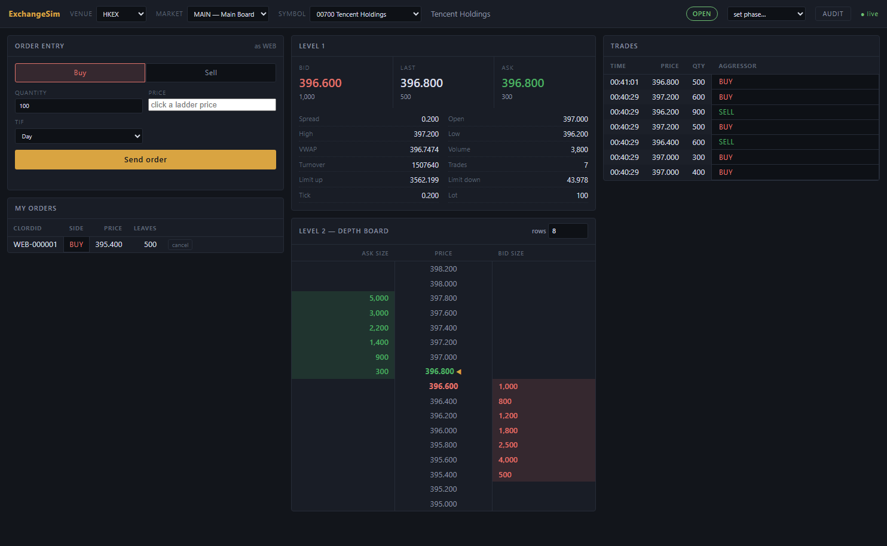
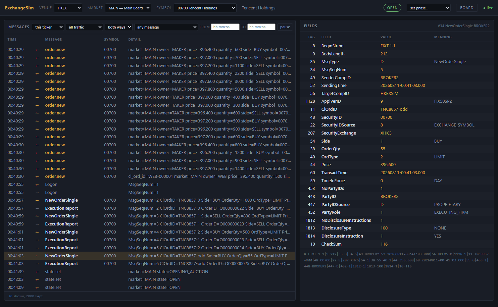

# ExchangeSim

A self-hosted exchange simulator you can run on your own machine or in a CI job.
It stands in for a venue's test environment: your trading client connects over
FIX and cannot tell the difference, but you can open and close the market
whenever you like, watch the order book in a browser, place orders by hand, and
read back every message that crossed the wire.

Two venues ship today:

| Venue | Protocol | Port | Control port |
|---|---|---|---|
| **Japannext PTS** equities | FIX 4.2 | 9001 | 9101 |
| **HKEX securities market** (SEHK) | OCG-C — FIX 5.0 SP2 over FIXT.1.1 | 9011 | 9102 |
| | OCG-C — the same protocol, binary encoding | 9012 | |

HKEX publishes OCG-C in two interchangeable encodings and this serves both, on
one set of books: a binary client and a FIX client trade with each other.

A real venue's UAT is open only during published windows, needs booked slots and
credentials, is shared with everyone else, and cannot be told to halt a stock
because you would like to see what your client does about it. This can.



**Requirements: Python 3.6.8 or newer, and nothing else.** No packages to
install, at build time or run time — the standard library is the whole
dependency list. It is developed against RHEL 8's `platform-python`.

> Looking for the architecture, the venue rules, or what was assumed where a
> specification was silent? That is all in **[DETAILED_DOC.md](DETAILED_DOC.md)**.

---

## Install

```bash
git clone <this repository> exchangesim
cd exchangesim
python -m unittest discover -s tests -t .    # optional: confirm it runs here
```

There is nothing to build and nothing to install. If you want it on a server as
a service, see *Deployment* in [DETAILED_DOC.md](DETAILED_DOC.md).

On Windows, use `venv36\Scripts\python.exe` in place of `python` below if that
is where your 3.6 lives.

## Start it

Each venue is its own process, with its own ports. Start the ones you need:

```bash
python -m exchangesim.runner.main --config config/japannext.json &
python -m exchangesim.runner.main --config config/hkex.json &
```

Then the web board, which is a separate process again and talks to whichever
venues are running:

```bash
python -m exchangesim.web.main --config config/web.json &
```

Open **<http://127.0.0.1:9200>**.

A venue that is not running simply shows as offline in the board's venue menu,
and is picked up automatically when you start it. Stopping the board does not
disturb the venues, and vice versa.

To check a config without starting anything:

```bash
python -m exchangesim.runner.main --config config/hkex.json --check
```

## Using the web board

Everything on the page is live: orders, trades and market-state changes appear
as they happen, and the indicator at the top right reads **live** while the
event stream is connected.

### Choosing what to look at

The header picks the venue, the market and the instrument, in that order.
Changing the venue reloads the markets, changing the market reloads the
instruments. To the right of the selectors is the market's current **phase**
badge — OPEN, CLOSED, HALTED, an auction — and beside that a **set phase** menu
if this board is allowed to move markets.

Bookmark any of it:

```
http://127.0.0.1:9200/?venue=hkex&market=MAIN&symbol=00700
http://127.0.0.1:9200/?symbol=7203&live=0     # a static snapshot, no updates
```

### The board

**Level 1** heads the right-hand column: best bid, last trade and best offer
with their sizes, then the day's statistics — spread, open, high, low, VWAP,
volume, turnover, trade count, the price limits, and the instrument's tick size
and board lot.

**Level 2** has the middle column to itself, a Japanese-style depth board: one
row per tick, ask size on the left, price down the centre, bid size on the
right. `OVER` and `UNDER` carry everything resting outside the window, and a
`MARKET` row appears above and below them during an auction for orders that
carry no price. The **rows** control sets how many ticks to show each side of
the touch.

Colours follow the Japanese convention, which is the reverse of the Western one:
**buying is red and selling is green**. The board itself is dark or light
according to the machine it is opened on — whatever the operating system or
browser reports as its preferred colour scheme — and a browser that states no
preference gets the dark board.

**Trades** sits beneath Level 1 on the right — the price as it stands, above the
prints that put it there. Newest first, and each new trade arrives lit.

### Placing an order

The order entry panel sends orders as the owner **WEB**. Pick a side, a quantity
and a price, choose Day, IOC or FOK, and send.

* **Clicking a price on the depth board** fills the price field, which is the
  quickest way to be certain the price is on a valid tick.
* **Up and down arrows in the price field** step one row along the depth board.
  That is not a fixed step: tick size changes with price at both venues, and
  walking the venue's own rows is the only way to stay aligned across a
  threshold.
* **Quantity steps by the instrument's board lot**, which differs by security —
  100 for Tencent, 500 for CK Hutchison, 2,000 for some GEM names. An odd lot can
  still be typed; the venue is what decides whether it is acceptable, and it will
  reject it with a proper reason.

**My orders** below lists what is still working, with a cancel button per row. A
rejected order is not an error — the panel shows the venue's reason, which is
usually the interesting part.

Orders placed here are ordinary orders. They go through the same validation and
the same matching engine as a FIX order, so if your client has an order resting
on the other side, this will trade with it and your client will receive a
correct execution report.

### Moving the market

The **set phase** menu closes, opens, halts or opens an auction on the selected
market. Two things to know before using it:

* it acts on the **market**, not on the one instrument you are looking at, and
* closing a market **expires every resting order on it**, including other
  clients'.

The phases offered are the venue's own, so the menu always matches what that
venue actually supports.

### The message audit

The **audit** button in the header swaps the board for a record of everything
the simulator has said and been told: every FIX message in and out of every
session, and every command that changed something — so an order you place from
the board sits on the same tape as the traffic it caused.

The newest entry is at the top, so what just happened is on screen without
scrolling; older traffic runs down the page. Scroll into the tape and it stays
where you left it as new rows arrive above.

It follows the instrument you have selected, and always includes the
session-level messages that usually explain it — Logon, Reject — marked as
belonging to no instrument. You can narrow it by direction, by FIX versus
command, by message type, and by a time window. **no HB** is on by default and
hides Heartbeat traffic, which is all an idle session produces and would
otherwise push the traffic you opened the audit for out of the window; clear it
to see the heartbeats too.

**Click any row** and the right-hand pane shows the message field by field: the
tag, the field's name, its raw value, and what that value means — `39=1` reads
`PARTIALLY_FILLED`, `54=1` reads `BUY` — with the message exactly as it was on
the wire underneath. A binary message is shown as a hex dump, offsets and all,
so it can be read against your own gateway's log; either way a password is
struck out rather than displayed.



Above, the tape runs from orders placed through the control plane, through a
client's Logon and its order flow, to the phase changes at the end; the selected
row is an odd-lot order the venue rejected.

**Pause** freezes the tape so a row you are reading stays put while traffic
continues. Resuming catches up, and tells you if it had to skip anything.

This is the first place to look when a client is not behaving. Messages the
venue could not accept are recorded too, with the reason:

```
23:59:53  <--  Logon    MsgSeqNum=1
23:59:53  -->  Logout   Text=NextExpectedMsgSeqNum (789) is required for MsgType 'A'
```

## Connecting your own client

The shipped configs define two sessions per venue, ready to use:

| Venue | Host:port | SenderCompID (venue) | TargetCompID (you) |
|---|---|---|---|
| Japannext | `127.0.0.1:9001` | `JNXSIM` | `CLIENT1`, `CLIENT2` |
| HKEX, FIX | `127.0.0.1:9011` | `HKEXSIM` | `BROKER1`, `BROKER2` |
| HKEX, binary | `127.0.0.1:9012` | `HKEXSIM` | `BROKER3` |

**Japannext** is FIX 4.2 (`BeginString=FIX.4.2`). Logon needs
`EncryptMethod(98)=0` and `HeartBtInt(108)`; `ResetSeqNumFlag(141)=Y` is
accepted. Every message names its market in `TargetSubID(57)` — `DAY`, `NGHT`,
`DAYX` or `DAYU` — falling back to the session's `default_sub_id`. Instruments
are named by `Symbol(55)`: `7203`, `6758`, `9984` and others in
`exchangesim/venues/japannext/reference/symbols.csv`.

**HKEX** is FIXT.1.1 carrying FIX 5.0 SP2. Logon additionally requires
`DefaultApplVerID(1137)=9` and `NextExpectedMsgSeqNum(789)`, and the venue
**refuses** a client-initiated sequence reset — use the `session.reset` command
instead. Instruments are named by `SecurityID(48)` with
`SecurityIDSource(22)=8` and `SecurityExchange(207)=XHKG`: `00700`, `00001`,
`00005` and others in `exchangesim/venues/hkex/reference/securities.csv`. No
message names a market — the security's segment decides which book it reaches.
Every business message carries a `<Parties>` group and a
`<DisclosureInstructionGrp>`.

**The HKEX binary encoding** is the same protocol on a different wire, so
everything above about instruments, segments and groups still holds — what
changes is how the bytes are laid out. Point a binary client at **9012** with a
Comp ID registered for it (`BROKER3` as shipped), and note that the frame
carries **one Comp ID, your own**: there is no Sender/Target pair, so a client
that puts the venue's `HKEXSIM` there will not be recognised. Logon needs
`Password` and `Next Expected Message Sequence` and has no EncryptMethod or
HeartBtInt to send. A refused cancel or amend comes back as an Execution Report
with `Exec Type` `X` or `Y`, this encoding having no OrderCancelReject.

A session belongs to one encoding: add `"protocol": "binary"` to its entry in
the config's `fix.sessions`, and set the listener's port in the `binary` block.
The binary port opens only when at least one session asks for it.

`CLIENT1`, `BROKER1` and `BROKER3` have **Cancel on Disconnect** switched on, so their
resting orders are pulled when the socket closes; `CLIENT2` and `BROKER2` do
not. That catches people out — if orders you placed keep vanishing, that is why.

To change ports, comp IDs or add sessions, edit the `fix` block of the venue's
config file and restart it.

## The command line

`exsim` does everything the board does, and more. It prints tables by default
and JSON with `--json`.

```bash
export EXSIM_MARKET=DAY                   # saves typing --market

python -m exchangesim.cli.exsim info                 # what this venue is
python -m exchangesim.cli.exsim instruments          # the universe
python -m exchangesim.cli.exsim state set OPEN       # open the market
python -m exchangesim.cli.exsim ladder 7203          # the depth board
python -m exchangesim.cli.exsim monitor 7203         # live, redraws on updates
python -m exchangesim.cli.exsim trades 7203          # the tape
python -m exchangesim.cli.exsim orders                # what is working
python -m exchangesim.cli.exsim audit                 # everything said
python -m exchangesim.cli.exsim audit -x 0            # without the heartbeats
python -m exchangesim.cli.exsim audit --seq 128       # one message, field by field
python -m exchangesim.cli.exsim sessions              # FIX session state
```

`--port 9102` points it at another venue. `EXSIM_HOST`, `EXSIM_PORT`,
`EXSIM_TOKEN` and `EXSIM_MARKET` supply defaults. Exit codes are part of the
contract: **0** success, **1** the venue rejected the command, **2** usage
error, **3** could not reach the venue.

Two things worth knowing early:

```bash
# Add an instrument at runtime -- no restart, no CSV edit
exsim instrument add 1234 --base-price 1000

# Make the venue misbehave on purpose, to exercise your error handling
exsim call behaviour.set '{"action":"reject","count":1,"reason":"OTHER"}'
exsim call behaviour.set '{"action":"delay","count":1,"delay_ms":2000}'
exsim call behaviour.set '{"action":"drop","count":1}'
```

## Running it in CI

Start the venues, run the scenario suite, stop them. A scenario is a JSON file
of steps driven over real sockets; each names the venue it runs against, so one
invocation covers them all:

```bash
python -m exchangesim.scenario.runner "scenarios/*.json"
```

It exits non-zero on the first mismatch and prints what actually arrived. The
shipped scenarios in `scenarios/` double as worked examples of every flow the
simulator supports. Writing your own is covered in
[DETAILED_DOC.md](DETAILED_DOC.md).

## Configuration in brief

One JSON file per venue, in `config/`. The keys you are most likely to touch:

| Key | What it does |
|---|---|
| `control.port` | the port `exsim` and the web board connect to |
| `control.token` | a shared secret, if you want one; `null` means open |
| `fix.port` | where your client connects |
| `fix.sessions` | one entry per client: comp ID, heartbeat, cancel-on-disconnect |
| `markets` | which markets exist and what phase each starts in |
| `audit.capacity` | how many messages the audit keeps; `0` switches it off |

`config/web.json` lists the venues the board should watch, and carries three
switches for what a board is allowed to do:

```json
{ "allow_order_entry": true, "allow_market_control": true, "allow_audit": true }
```

Each is refused server-side, not merely hidden. Set all three to `false` to
serve a board that can only watch.

## Where things live

```
config/         one file per venue, plus the web board's
scenarios/      example scenarios; the CI suite
exchangesim/    the simulator itself
  venues/       one package per exchange, with its reference data as CSV
  web/          the browser board
  cli/          exsim
docs/specs/     which published specification each behaviour came from
```

Instrument tables, tick ladders and price bands are CSV files under each venue's
`reference/` directory, so correcting one is a data edit rather than a code
change.

## Further reading

**[DETAILED_DOC.md](DETAILED_DOC.md)** — the architecture and its seams, how the
two venues differ and why, the auction mechanics, the price rules, the control
command surface, writing scenarios, deployment, development notes, the published
specifications each behaviour came from, and every place a specification was
silent and a choice had to be made.
